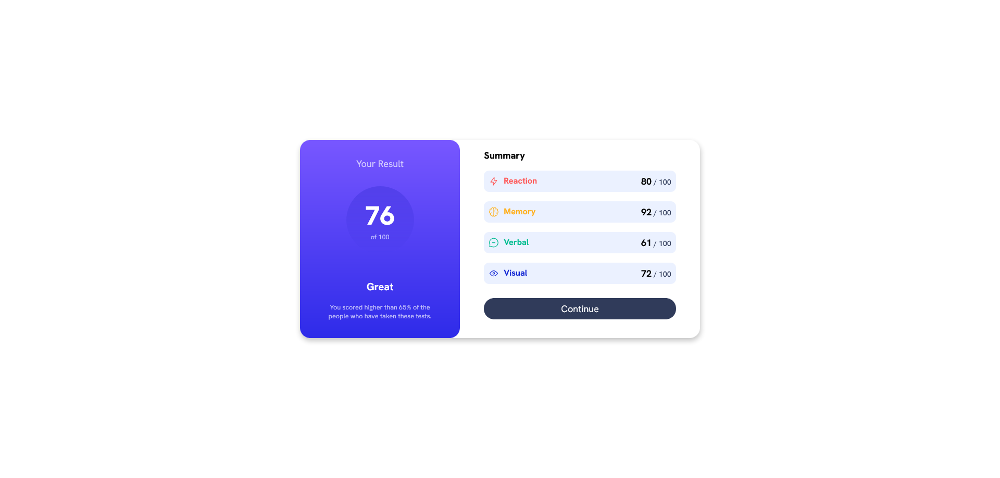
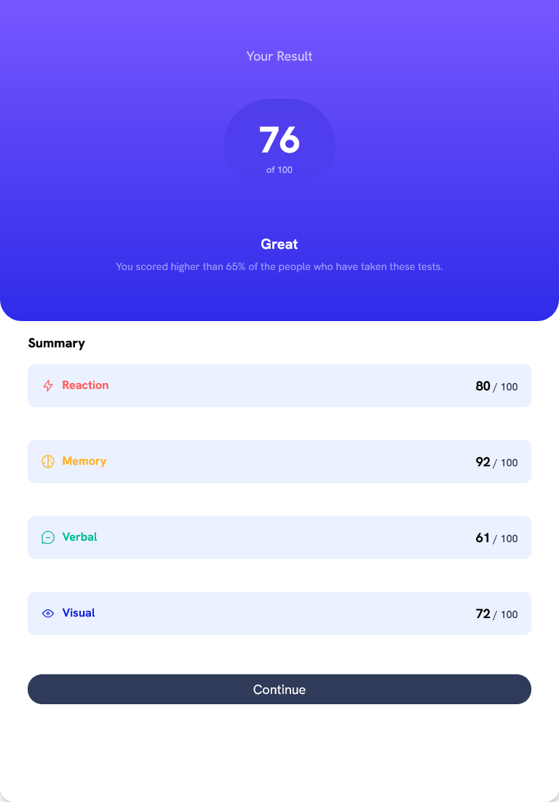
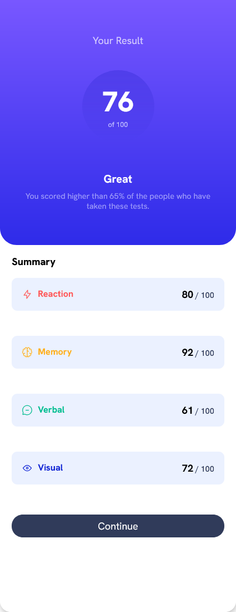

# Frontend Mentor - Results summary component solution

This is a solution to the [Results summary component challenge on Frontend Mentor](https://www.frontendmentor.io/challenges/results-summary-component-CE_K6s0maV).

## Overview

### The Challenge
Your users should be able to:

- View the optimal layout for the interface depending on their device's screen size
- See hover and focus states for all interactive elements on the page

### Screenshot

### Links

- Live Site URL: [Click Here](https://talktodeego.github.io/fem-resultsummary/)

## My process

### Built with

- Semantic HTML5 markup
- CSS custom properties
- Flexbox
- Mobile-first workflow

## Author

- Frontend Mentor - [@talktodeego](https://www.frontendmentor.io/profile/talktodeego)
- Linkedin - [@diegoboscolo](https://www.linkedin.com/in/diegoboscolo/)
